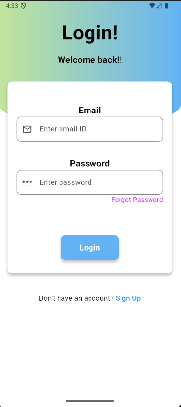
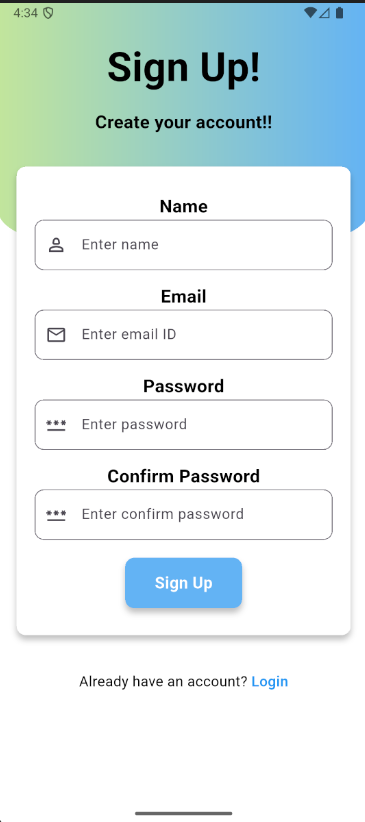

# 📱 PulseDaily 🌐

**PulseDaily** is a sleek, cross-platform news application built with **Flutter** that delivers a dynamic, global news feed directly to your fingertips.  
The app is designed to provide a **clean, intuitive, and feature-rich reading experience**, aggregating top headlines from multiple countries and sorting them by category.

---

## ✨ Features

- **🌍 Global News Feed** – Fetches and shuffles top headlines from multiple countries (India, US, UK, etc.) for a diverse, worldwide perspective.  
- **📂 Category Filtering** – Smooth, tab-based UI to switch between topics like *Top News, Technology, Sports, Business,* and more.  
- **🔐 Full User Authentication** – Secure registration, login, and password reset with Firebase Authentication.  
- **📌 Persistent Bookmarks** – Save favorite articles locally using `shared_preferences` for offline access.  
- **🔗 External Article Viewing** – "Read More" button opens the original article in your default browser via `url_launcher`.  
- **💎 Clean & Responsive UI** – Beautiful design optimized for Android & iOS.  

---

## 🛠️ Tech Stack

| Component         | Technology Used |
|-------------------|-----------------|
| **Frontend**      | Flutter |
| **Backend/Auth**  | Firebase |
| **State Mgmt**    | Provider |
| **API**           | [NewsAPI.org](https://newsapi.org/) via `http` package |
| **Local Storage** | `shared_preferences` |
| **Web Linking**   | `url_launcher` |

---

## 🚀 Getting Started

### Prerequisites
- [Flutter SDK](https://docs.flutter.dev/get-started/install) installed  
- A code editor like VS Code or Android Studio  
- An active Firebase project  

---

### Installation

1. **Clone the repository**  
   ```bash
   git clone https://github.com/Angadthakur/PulseDaily
   ```

2. **Navigate to the project directory**
   ```bash
   cd pulsedaily
   ```

3. **Install dependencies**
   ```bash
   flutter pub get
   ```

4. **Set up Firebase**
   Follow FlutterFire setup guide

   Place google-services.json (Android) and/or GoogleService-Info.plist (iOS) in the correct directories

5. **Set up API Key**
   Sign up on NewsAPI.org to get a free API key
   Open lib/services/news_service.dart and replace:
   ```dart
   final String _apiKey = "YOUR_API_KEY_HERE";
   ```
   with your API key

6. **Run the app**
   ```bash
   flutter run
   ```

---

## 📸 Demo

### 🔑 Login Screen 


### ✍️ SignUp Screen 


### 🏠 Home Screen  


### 📂 Bookmark Screen 


### 🎥 Full Walkthrough  
[](https://youtube.com/shorts/Rx8a8q2jPRc)


*Click the image above to watch the complete app demonstration*

---

## 🤝 Contributing

Contributions, issues, and feature requests are welcome! Feel free to check the [issues page](https://github.com/Angadthakur/PulseDaily/issues).

1. Fork the Project
2. Create your Feature Branch (`git checkout -b feature/AmazingFeature`)
3. Commit your Changes (`git commit -m 'Add some AmazingFeature'`)
4. Push to the Branch (`git push origin feature/AmazingFeature`)
5. Open a Pull Request

---

## 📄 License

This project is licensed under the MIT License - see the [LICENSE](LICENSE) file for details.

---

## 👤 Contact

**Angad Thakur**  
LinkedIn: [www.linkedin.com/in/angad-thakur-51817b280](https://www.linkedin.com/in/angad-thakur-51817b280)

## 🔗 Project Link
[https://github.com/Angadthakur/PulseDaily](https://github.com/Angadthakur/PulseDaily)   
